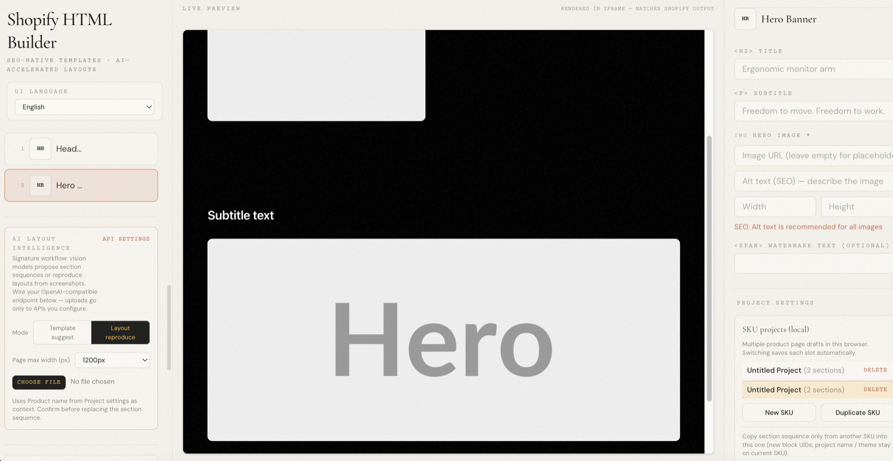

# shopify-html-builder（简体中文）

基于浏览器的 **Shopify 商品详情 HTML 搭建器**，用于生成**带作用域、可直接上线**的片段或整页。产品围绕两大核心能力设计：

1. **原生 SEO 工作流** — 通过 alt、语义化标题层级、图片性能提示与导出前检查，让每次导出都自带合规约束，而不是事后补救。  
2. **AI 布局智能** — 兼容 OpenAI 的视觉接口可建议区块顺序、从长截图还原布局，并加速 alt/文案草稿（密钥由你配置；图片只发往你信任的端点）。

**当前状态**：`0.3.0-rc.1`（发布候选）。

**代码仓库**：[github.com/DylanGmm/shopify-html-builder](https://github.com/DylanGmm/shopify-html-builder)  
**英文文档**：[README.md](../README.md)

## 界面预览

左侧为组件 / 区块序列 / AI 工具，中间为实时预览，右侧为槽位编辑与导出。



## 功能概览

- **九类区块组件**（页头、主视觉、混排网格、左右分栏、三列网格、居中文案 + 可选图例、选项行、蓝图栅格等），槽位类型明确。  
- **实时预览**：沙箱 iframe，与导出的完整 HTML 文档一致。  
- **SEO 面板**：alt 覆盖、标题跳级、重复 alt、尺寸与超大图提示。  
- **AI 辅助**：模板建议 / 布局还原、负载估算、瞬时错误自动重试一次。  
- **主题**：可按项目覆盖 `--ic-*` CSS 变量；可选在预览或整页导出中注入 HTTPS 主题样式表。  
- **多 SKU**：同一浏览器配置多草稿、按 SKU 导出/导入 JSON、在 SKU 间复制区块序列（替换或追加）。  
- **持久化**：Zustand `persist`，键名 `shopify-html-builder-v1`。  
- **图片切片**：在长图上框选区域 → 导出切片或写入图片槽（data URL）。  
- **本地 OCR**：Tesseract.js 浏览器内运行，适合标题级文字提取。  
- **导出**：整页 HTML 下载/复制、Shopify 片段复制、可选 Product JSON-LD、可选 `srcset`/`sizes`、全部 SKU ZIP、带 `` 的 Shopify section `.liquid`。

## 导出形态

| 操作 | 输出 | 常见用途 |
|------|------|----------|
| **导出完整 HTML** | 含 DOCTYPE / head / body 的整页 | 本地预览、归档、静态托管 |
| **复制完整 HTML** | 与下载文件相同 | 需要完整文档字符串的工具 |
| **复制 Shopify 片段** | 内联样式 + 作用域根节点 | Shopify 后台商品描述 HTML 模式 |

## 快速开始

```bash
npm install
npm run dev
```

```bash
npm run build
npm run lint
npm run preview
```

## 技术栈

- React 19、TypeScript（严格模式）、Vite 8  
- Tailwind CSS 4（仅编辑器 UI；导出 HTML 使用作用域自定义 CSS）  
- Zustand、JSZip、Tesseract.js

## 安全提示

AI 与主题 CSS 功能会涉及**用户配置的 URL 与浏览器内的 API 密钥**。若面向不可信用户部署，请先阅读 [M3 RC 安全审计（英文）](./audit/2026-03-27-m3-rc-audit.md)。

## 维护说明

详细需求文档可能在本地 `memory-bank/`（部分克隆会 gitignore）。若协作者看不到该目录，请将必要说明同步到本 `docs/` 目录。

## 许可证

本项目使用 **Apache License 2.0**。全文见仓库根目录 [LICENSE](../LICENSE) 与 [NOTICE](../NOTICE)。
